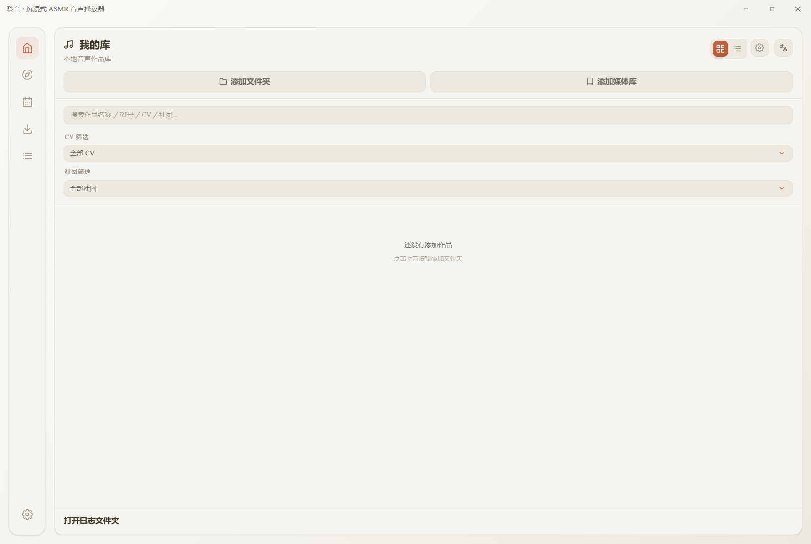
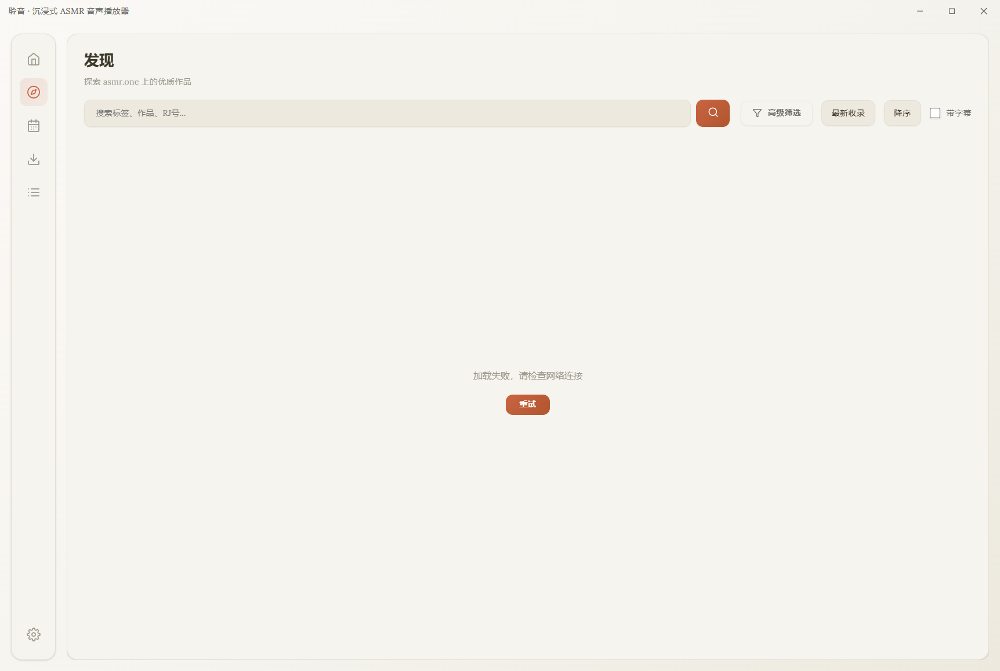

# 聆音 Lingyin

一款精美的沉浸式 ASMR 桌面播放器，专为音声/同人音声爱好者打造。基于 Electron + React + Vite 构建，支持本地音声播放、在线 ASMR 发现、字幕/歌词展示、DLsite 元数据自动刮削等丰富功能。

## 📋 更新日志

### v1.37.0 — 沉浸式模式播放控制，完整交互体验
**发布日期：2026-07-01**

本次更新为沉浸式播放模式带来了完整的播放控制功能，让您在全屏欣赏封面和歌词时，无需退出即可完成所有播放操作，体验更加沉浸流畅。

**✨ 新功能**
- **完整播放控制栏** — 沉浸式模式底部新增功能丰富的控制栏
  - **进度条**：渐变填充，支持点击和拖拽跳转，hover 显示圆形滑块
  - **时间显示**：当前时间 / 总时长，等宽数字字体，清晰易读
  - **播放控制**：上一曲、播放/暂停、下一曲，大尺寸按钮操作便捷
- **音量控制** — 独立音量按钮，hover 展开滑块，支持静音一键切换
- **播放速度调节** — 六档速度可选（0.5x / 0.75x / 1x / 1.25x / 1.5x / 2x）
- **书签功能** — 一键添加当前位置书签，实时显示当前音频书签数量
- **睡眠定时器** — 快捷切换默认倒计时，底部显示当前定时器状态
- **智能控制栏隐藏** — 鼠标静止 3 秒后自动淡出，移动鼠标立即恢复
  - 顶部信息栏同步隐藏/显示
  - 平滑的淡入淡出动画，过渡自然
- **顶部信息栏** — 重新设计的顶部布局
  - 左侧：关闭按钮
  - 中间：作品标题 + 社团名
  - 右侧：翻译切换按钮

**🎨 视觉优化**
- 控制栏采用毛玻璃效果（backdrop-filter），与背景融合自然
- 播放按钮采用暖橙渐变，带柔和光晕效果
- 所有按钮均有 hover 放大和按下反馈动画
- 进度条带主题色发光效果，视觉层次丰富
- 高 DPI 屏幕适配，图标和按钮尺寸自动调整

**🔧 技术实现**
- 播放控制通过 `playerRef` 命令式 API 与 AudioPlayer 交互
- 使用 `requestAnimationFrame` 实现进度条平滑更新
- 鼠标闲置检测使用防抖机制，性能开销极低
- 所有新增状态通过 props 传入，保持组件纯粹性
- 响应式设计，适配不同屏幕尺寸

### v1.36.0 — 作品排序系统，灵活管理音声库
**发布日期：2026-07-01**

本次更新新增了作品排序功能，支持多种排序维度和升序/降序切换，让您可以更灵活地组织和浏览音声库。

**✨ 新功能**
- **6 种排序方式** — 侧边栏新增排序下拉菜单，支持多维度排序
  - **添加时间**：按作品添加到媒体库的时间排序（默认）
  - **更新时间**：按作品元数据最后更新时间排序
  - **作品名称**：按作品标题拼音/字母顺序排序
  - **总时长**：按作品音频总时长排序
  - **评分**：按作品评分高低排序
  - **发售日期**：按作品发售日期排序
- **升序/降序切换** — 一键切换排序方向
  - 排序下拉菜单右侧的箭头按钮
  - 按钮高亮显示当前排序方向
  - 状态持久化保存，重启后自动恢复
- **全局适用** — 我的库和收藏视图均支持排序
  - 与筛选、搜索、分组功能叠加生效
  - 批量选择模式下排序保持有效

**🎨 视觉优化**
- 排序控件与现有筛选区域风格统一
- 升序/降序按钮带有主题色高亮反馈
- 平滑过渡动画，交互流畅自然

**🔧 技术实现**
- 排序逻辑集成在 `useAppState.js` 的 `filteredWorks` 计算中
- 使用 `useMemo` 缓存排序结果，避免不必要的重计算
- 设置持久化存储到 localStorage 和数据库
- 中文标题使用 `localeCompare` 进行拼音排序

### v1.35.0 — 作品批量选择功能，高效管理音声库
**发布日期：2026-07-01**

本次更新带来了期待已久的作品批量选择功能，让您可以一次性对多个作品进行收藏、移动分组、删除等操作，大幅提升音声库管理效率。

**✨ 新功能**
- **作品批量选择** — 侧边栏新增批量选择模式，支持多选作品
  - 一键进入/退出批量选择模式，操作便捷
  - 支持全选、取消全选、反选等常用操作
  - 实时显示已选中作品数量
  - 选中作品高亮显示，视觉反馈清晰
- **批量操作工具栏** — 批量模式下顶部显示操作栏
  - **批量收藏**：一键收藏/取消收藏所有选中作品
  - **批量移动分组**：将选中作品批量移动到指定文件夹分组
  - **批量删除**：一次性删除多个选中作品（带确认提示）
- **完整的交互反馈**
  - 选中作品边框高亮 + 发光效果
  - 复选框三态设计（未选/半选/全选）
  - 操作完成后 Toast 提示结果

**🎨 视觉优化**
- 批量操作栏采用主题渐变色，与整体风格一致
- 复选框动画流畅自然，状态切换清晰
- 选中作品卡片阴影增强，层次分明

**🔧 技术实现**
- 新增 `useBulkSelection` Hook，封装完整的批量选择状态管理
- 与现有收藏、分组、删除功能无缝集成
- 支持在我的库和收藏视图中使用
- 深色模式完美适配

### v1.34.0 — 主题系统全面升级，多套预设主题与自定义配色
**发布日期：2026-07-01**

本次更新对主题系统进行了全面升级，新增 8 套精美预设主题、支持自定义主题色以及跟随系统自动切换明暗模式，让你的聆音更加个性化。

**✨ 新功能**
- **8 套预设主题配色** — 精心设计的主题色，一键切换
  - **暖橙**：经典暖橙色系，温暖舒适（默认）
  - **森绿**：清新森林绿，自然宁静
  - **海蓝**：深邃海蓝色，沉静专注
  - **薰衣**：优雅薰衣草紫，梦幻浪漫
  - **玫红**：温柔玫红色，甜美细腻
  - **琥珀**：明亮琥珀黄，活力温暖
  - **青碧**：清透青碧色，清爽明亮
  - **岩灰**：简约岩灰色，沉稳大气
- **自定义主题色** — 自由选择喜欢的颜色作为主题色
  - 颜色选择器实时预览效果
  - 自动生成完整的色阶（100-900）
  - 渐变、发光、阴影效果自动适配
- **跟随系统主题** — 新增自动模式，跟随系统切换明暗主题
  - 浅色 / 深色 / 自动 三种模式可选
  - 系统主题变化时实时响应
  - 配合预设主题色，明暗模式分别适配

**🎨 视觉优化**
- 主题切换过渡动画更流畅自然
- 设置面板外观 Tab 全新设计，主题选择更直观
- 主题配色预览采用渐变圆形展示，视觉效果更佳
- 自定义颜色支持色值显示，方便精确调节

**🔧 技术实现**
- 新增 `themePresets.js` 主题工具库，包含颜色处理函数和预设配置
- `applyThemeColors` 动态生成并注入 CSS 变量，实现实时主题切换
- 自动生成 9 级色阶（accent-100 到 accent-900），确保各场景颜色协调
- 亮色/暗色模式分别优化颜色参数，保证两种模式下的视觉效果

### v1.33.0 — 全局搜索全面升级，支持在线作品搜索
**发布日期：2026-07-01**

本次更新对全局搜索进行了全面升级，新增 ASMR.one 在线作品搜索功能，并对搜索体验进行了深度优化。

**✨ 新功能**
- **在线作品搜索** — 全局搜索新增 ASMR.one 在线作品搜索能力
  - 输入关键词即可同时搜索本地作品和在线作品
  - 在线搜索结果独立分组展示，带「在线」专属标识
  - 点击在线作品直接跳转至发现页查看详情
  - 搜索结果展示作品封面、标题、社团、CV 等关键信息
- **搜索防抖优化** — 实现 300ms 智能防抖，减少不必要的 API 调用
  - 输入停止后自动触发搜索，提升响应流畅度
  - 避免快速输入时产生大量冗余请求
- **在线搜索状态反馈**
  - 加载中显示旋转动画，视觉反馈清晰
  - 搜索失败时展示友好的错误提示
  - 无结果时显示「未找到相关在线作品」提示

**🔧 技术实现**
- GlobalSearchModal 组件重构，支持多数据源搜索结果聚合
- 新增 `onSelectOnlineWork` 回调，打通搜索→发现页跳转链路
- 预留 `audioFilesMap` 接口，为后续曲目级搜索做准备
- 完善深色模式下所有新增 UI 元素的样式适配

### v1.32.0 — 数据备份与恢复系统全新上线
**发布日期：2026-07-01**

本次更新带来了完整的数据备份与恢复系统，让您可以轻松导出和导入所有数据，防止数据丢失，支持设备迁移。

**✨ 新功能**
- **数据备份与恢复** — 在设置面板新增「数据管理」Tab
  - **数据统计**：实时展示各类数据数量和总大小
  - **导出备份**：自由选择要导出的数据类型，保存为 JSON 文件
  - **导入备份**：支持「合并」和「覆盖」两种导入模式
  - 支持导出的数据：本地作品、播放进度、播放历史、字幕选择、用户设置、播放列表、翻译缓存、收藏列表、文件夹分组、书签
- **合并模式**：保留现有数据，将备份中的新数据合并进来，自动去重
- **覆盖模式**：用备份数据完全替换现有数据（⚠️ 谨慎操作）

**🔧 技术实现**
- 主进程新增 IPC 接口：`backup:getStats`、`backup:export`、`backup:import`、`backup:saveFile`、`backup:openFile`
- 前端新增数据管理面板，支持勾选导出、模式选择、结果反馈
- 导入时自动验证备份文件格式，确保数据完整性

### v1.31.0 — 智能播放列表系统全新上线
**发布日期：2026-07-01**

本次更新带来了全新的智能播放列表系统，基于您的聆听行为和媒体库数据自动生成 6 种智能列表，让发现和重温喜爱的音声更加便捷。

**✨ 新功能**
- **智能播放列表** — 系统内置 6 种智能列表，自动生成无需手动管理
  - **最近添加**：最近添加到媒体库的新曲目
  - **最多播放**：您听得最多的热门曲目
  - **未听完**：播放进度不到 90% 的曲目，继续聆听
  - **最近播放**：最近听过的曲目，一键重温
  - **我的收藏**：所有收藏作品的曲目合集
  - **随机推荐**：随机抽取 50 首，发现新惊喜
- **播放列表视图全新改版**
  - 左侧分两组展示：智能播放列表 + 我的播放列表
  - 智能列表带专属图标，视觉更清晰
  - 智能列表详情页显示描述和刷新按钮
  - 普通列表创建按钮移到分组标题旁，布局更合理
- **智能列表交互体验**
  - 点击智能列表自动加载内容，带加载动画
  - 刷新按钮可重新生成列表内容
  - 智能列表为只读，不支持添加/删除/排序
  - 曲目行保留播放和跳转功能，操作便捷

**🎨 视觉优化**
- 播放列表左侧栏分组展示，层次更清晰
- 智能列表专属图标和暖橙色主题
- 智能列表详情页带「智能」徽章标识
- 加载状态 spinner 动画，过渡更流畅

**🔧 技术实现**
- 主进程新增 IPC 接口：`smartPlaylist:getAll`、`smartPlaylist:getItems`
- 6 种智能列表算法：按时间/播放次数/进度/收藏/随机等维度生成
- 前端重构 PlaylistView，支持智能/普通双模式切换
- 智能列表数据实时计算，不写入数据库

### v1.30.0 — 播放体验全面升级：队列持久化、作品间连续播放、启动恢复
**发布日期：2026-07-01**

本次更新围绕播放体验进行了全面升级，新增播放队列持久化、作品间连续播放和启动恢复功能，让你的聆听更加无缝连贯。

**✨ 新功能**
- **播放队列持久化** — 关闭再打开也能恢复播放队列
  - 自动保存队列到本地数据库
  - 启动时自动恢复上次的队列内容
  - 可在设置中自由开关
- **作品间连续播放** — 听完一个作品自动播放下一个
  - 当前作品最后一首播放完毕后，自动切换到下一个作品
  - 基于当前筛选列表顺序连续播放
  - 队列播放模式下不触发，队列优先
- **启动恢复播放** — 打开应用自动回到上次聆听状态
  - 自动恢复上次播放的作品和音频
  - 记住播放进度，从停下的地方继续
  - 播放中每 10 秒自动保存进度
- **设置面板新增选项**
  - 作品间连续播放开关
  - 启动恢复上次播放开关
  - 持久化播放队列开关
- **媒体库拖拽添加** — 拖拽文件夹到媒体库快速添加
  - 支持拖拽单个或多个文件夹
  - 拖拽时显示高亮提示区域
  - 与现有媒体库管理逻辑无缝集成

**🔧 技术实现**
- 主进程新增 IPC 接口：`playQueue:get/save/clear`、`lastPlayState:get/save`
- 队列变化时 500ms 防抖保存，优化性能
- 播放状态 10 秒定时保存，平衡进度精度与性能
- 统一封装 `handleFinish`，支持作品间连续播放扩展

### v1.29.0 — 使用报告全面增强：周视图、时段分析、数据导出与聆听洞察
**发布日期：2026-07-01**

本次更新对使用报告进行了全面升级，新增周度视图、聆听洞察、时段分析和数据导出功能，让你更全面地了解自己的聆听习惯。

**✨ 新功能**
- **周度视图** — 新增周度统计维度，查看本周聆听概况
  - 周一至周日每日聆听时长柱状图
  - 上一周/下一周自由切换
  - 与日/月/年视图统一的交互体验
- **聆听洞察卡片** — 用数据读懂你的聆听习惯
  - 活跃天数、日均时长、最长连续天数
  - 最活跃时段、最活跃日
  - 一周聆听分布可视化柱状图
- **时段分析** — 一天中的聆听时间分布
  - 五个时段：清晨（6-9点）、上午（9-12点）、下午（12-18点）、晚上（18-23点）、深夜（23-6点）
  - 横向进度条直观对比各时段聆听时长
- **数据导出** — 一键导出全部播放历史
  - 支持 CSV 格式（可用 Excel 打开分析）
  - 支持 JSON 格式（便于程序处理）
  - 导出内容包含所有历史记录字段
- **增强版趋势图** — SVG 柱状图全面升级
  - 可切换趋势线（移动平均平滑曲线）
  - 渐变填充 + 发光效果
  - 鼠标悬停显示详细数值 Tooltip

**🎨 视觉优化**
- 使用报告全新改版，卡片化布局更清晰
- 洞察卡片动画效果，数据展示更生动
- 时段分析横向进度条，视觉对比更直观
- 响应式布局适配不同窗口尺寸

**🔧 技术实现**
- `getUsageStats` 新增 week 视图支持
- 新增 `insights` 洞察数据聚合
- 新增 `timePeriods` 时段分布统计
- 新增 `exportHistoryCSV` / `exportHistoryJSON` 导出函数
- TimelineChart 重构为 SVG 实现，支持趋势线和 Tooltip

### v1.28.0 — 系统媒体集成全面增强
**发布日期：2026-07-01**

本次更新深度集成 Windows 系统媒体功能，新增系统媒体控制、全局媒体快捷键和曲目切换通知，让播放控制更自由、更便捷。

**✨ 新功能**
- **系统媒体控制（MediaSession）** — 与 Windows 系统媒体传输控制（SMTC）深度集成
  - 在系统音量面板中显示播放信息（曲目名、社团、作品名、封面）
  - 支持系统级播放/暂停、上一曲、下一曲控制
  - 支持快进、快退、跳转进度控制
  - 实时同步播放状态和进度
- **全局媒体快捷键** — 无需切换窗口即可控制播放
  - 支持播放/暂停键、下一曲键、上一曲键、停止键
  - 应用启动时自动注册，退出时自动注销
  - 后台播放时也能正常响应
- **曲目切换系统通知** — 切换曲目时实时提醒
  - 显示曲目名称和作品信息
  - 支持封面图标展示
  - 点击通知快速回到应用窗口
  - 静默通知，不打断聆听体验
- **设置面板集成** — 在「设置 → 基本 → 系统媒体集成」中自由配置
  - 系统媒体控制开关
  - 全局媒体快捷键开关
  - 曲目切换通知开关
  - 三项功能独立控制，按需开启

**🔧 技术实现**
- 基于 Chromium MediaSession API 实现系统媒体控制
- Electron globalShortcut 实现全局媒体键注册
- Electron Notification 实现系统通知
- 状态防抖优化，避免频繁更新系统媒体信息
- 通知去重机制，同一曲目不重复提醒

### v1.27.0 — 字幕样式全面自定义
**发布日期：2026-07-01**

本次更新新增字幕样式自定义系统，支持 4 种预设主题和丰富的自定义选项，普通播放界面与沉浸式模式各自独立配置，打造专属的字幕视觉体验。

**✨ 新功能**
- **字幕样式预设** — 4 种精心设计的预设主题
  - **默认**：经典灰字 + 暖橙高亮，与整体 UI 风格统一
  - **暖橙**：全暖色主题，暖橙文字 + 深橙高亮
  - **简约**：极简风格，淡灰文字 + 白色高亮
  - **高对比**：强对比风格，白色文字 + 橙色高亮，适合复杂背景
- **普通字幕自定义** — 播放界面字幕精细调节
  - 字体大小（10-24px）
  - 普通文字颜色
  - 高亮文字颜色
  - 字体粗细（300-700）
  - 文字阴影开关与模糊半径
- **沉浸式字幕自定义** — 沉浸式模式独立样式配置
  - 普通字体大小（14-40px）
  - 高亮字体大小（18-60px）
  - 普通/高亮文字颜色
  - 字体粗细
  - 文字阴影开关与模糊半径
- **即时预览** — 调整设置后字幕样式实时生效

**🎨 视觉优化**
- 设置面板新增字幕样式分区，预设按钮网格布局
- 颜色选择器带预设色板，操作更便捷
- CSS 变量驱动，样式切换流畅无闪烁

**🔧 技术实现**
- 新增 12 项字幕样式设置项，全部持久化存储
- LyricView 与 ImmersiveView 重构为样式驱动架构
- useMemo 优化样式计算，避免不必要的重渲染

### v1.26.0 — 睡眠定时器系统全面增强
**发布日期：2026-07-01**

本次更新对睡眠定时器进行了全面升级，新增三种定时模式和渐弱音量功能，睡前听 ASMR 更舒心。

**✨ 新功能**
- **三种定时模式** — 满足不同的睡前使用场景
  - **倒计时模式**：5/15/30/45/60/90 分钟预设，支持自定义分钟数（1-300 分钟）
  - **曲目结束模式**：当前曲目播放完毕后自动停止，听完一首刚好入睡
  - **指定时间模式**：设定时间点（如 23:00）自动停止，跨天自动顺延
- **渐弱音量** — 停止前 30 秒逐渐降低音量，自然入睡不突兀
  - 300 步平滑过渡，音量变化细腻无感知
  - 取消定时器时自动恢复原始音量
  - 可在定时器面板中自由开关
- **增强版面板 UI** — 全新设计的睡眠定时器面板
  - 三 Tab 切换，三种模式一目了然
  - 倒计时模式：3×2 预设网格 + 自定义输入
  - 激活状态显示"关闭"按钮，一键取消
  - 底部渐弱音量开关，带说明文字

**🎨 视觉优化**
- 渐弱时按钮呼吸闪烁动画，直观反馈状态
- 徽标显示剩余时间或状态（曲目结束 / 渐弱中...）
- 毛玻璃面板 + 暖橙主题，与整体 UI 风格统一

**🔧 技术实现**
- `useSleepTimer` Hook 完全重写，支持多模式架构
- 暴露 `handleTrackFinish` 方法，曲目结束模式与播放逻辑解耦
- 渐弱效果使用 100ms 间隔定时器 + Web Audio API 原生音量控制
- 取消定时器时自动恢复音量，避免音量残留问题

### v1.25.0 — 音频书签系统
**发布日期：2026-07-01**

本次更新新增音频书签系统，用户可在喜欢的音频片段位置添加书签，支持快速跳转、命名管理和按作品/音频层级组织，重温精彩片段更方便。

**✨ 新功能**
- **音频书签** — 在任意播放位置添加书签，记录喜欢的片段
  - 点击播放器右侧的书签按钮，一键在当前位置添加书签
  - 书签按钮显示当前音频的书签数量
  - 当前位置有书签时按钮高亮显示
- **书签管理面板** — 右侧标签栏新增 Bookmarks Tab
  - 显示当前音频的所有书签（按时间排序）
  - 显示当前作品的全部书签（按音频分组）
  - 点击书签即可跳转到对应播放位置
  - 双击书签名称可重命名（Enter 确认 / Escape 取消）
  - 支持删除单个书签
  - 空态展示使用统一 StateView 组件
- **书签数据持久化** — 所有书签数据保存在本地数据库
  - 按作品和音频层级管理书签
  - 书签包含：名称、时间、颜色、创建/更新时间等信息
  - 默认使用暖橙色主题色

**🔧 技术实现**
- 数据库新增 `bookmarks` 表，支持完整 CRUD 操作
- 新增 8 个 IPC 接口（getAll/getByWork/getByAudio/add/update/delete/deleteByWork/clearAll）
- 新增 `useBookmarks` Hook，封装书签状态管理和业务逻辑
- 新增 `BookmarksPanel` 组件，遵循项目 UI 设计规范
- 完全复用现有架构模式，与收藏、播放队列等功能保持一致

### v1.24.0 — 继续听功能与最近播放增强
**发布日期：2026-07-01**

本次更新全面增强最近播放与继续听体验，左侧导航栏新增「继续听」快捷入口，一键恢复上次未听完的音频；最近播放页面新增进度条、未听完标记和筛选功能，追剧式听感更顺畅。

**✨ 新功能**
- **继续听快捷入口** — 左侧导航栏顶部新增继续听按钮
  - 显示最近未听完音频的封面和播放进度
  - 一键点击即可恢复播放，自动跳转到上次的位置
  - 悬停显示播放按钮动效，交互更直观
- **最近播放进度展示** — 每个作品显示详细的播放进度
  - 进度条直观展示已听比例
  - 显示「已听时间 / 总时长」的具体数值
  - 未听完的作品显示「未听完」橙色标记
- **继续听按钮** — 最近播放列表中未听完的作品显示「继续」按钮
  - 一键从上次位置继续播放
  - 悬停时才显示，不干扰浏览
  - 暖橙色渐变按钮，视觉醒目
- **播放状态筛选** — 支持按播放状态筛选最近播放
  - 全部 / 未听完 / 已听完 三个分类 Tab
  - 快速找到没听完的作品继续听
  - 已听完的作品也能回顾

**🔧 技术实现**
- 新增 `db:getLastPlayedAudio` IPC 接口，获取最近未听完的音频
- 增强 `getRecentWorks` 返回进度信息（当前时间、总时长、百分比）
- 继续听逻辑复用现有的 `pendingAutoPlayRef` 模式，等待音频加载后自动播放
- 播放进度自动恢复基于已有的进度保存机制（每 5 秒保存一次）

### v1.23.0 — 迷你播放器模式
**发布日期：2026-07-01**

本次更新新增迷你播放器模式，点击播放器右侧的迷你按钮即可切换到悬浮小窗，一边工作一边听音声，体验更轻盈。

**✨ 新功能**
- **迷你播放器窗口** — 独立悬浮小窗，小巧精致不占空间
  - 显示封面、作品标题、曲目名称
  - 进度条实时同步，支持点击跳转
  - 播放/暂停、上一曲、下一曲快捷控制
  - 点击「展开」按钮回到主窗口
  - 点击「关闭」按钮关闭迷你窗口
- **拖拽移动** — 按住顶部标题栏可自由拖动迷你窗口位置
- **窗口缩放** — 支持调整迷你窗口大小（300x110 ~ 500x180）
- **置顶显示** — 迷你窗口始终置顶，不会被其他窗口遮挡
- **状态实时同步** — 主窗口与迷你窗口播放状态双向同步
  - 播放/暂停、进度、曲目信息实时同步
  - 迷你窗口控制操作直接作用于主播放器

**🔧 技术实现**
- 独立 BrowserWindow 实现迷你窗口，frame: false + transparent 实现无边框圆角
- IPC 广播机制实现主窗口→迷你窗口的状态同步
- IPC 事件监听实现迷你窗口→主窗口的控制指令
- 500ms 轮询同步播放状态，确保进度流畅更新

### v1.22.0 — 系统托盘与后台播放
**发布日期：2026-07-01**

本次更新新增系统托盘支持，关闭窗口后最小化到托盘继续后台播放，托盘菜单支持快捷播放控制，听歌更便捷。

**✨ 新功能**
- **系统托盘图标** — 应用启动后在任务栏显示托盘图标
  - 单击托盘图标：切换窗口显示/隐藏
  - 双击托盘图标：显示主窗口并聚焦
  - 右键托盘图标：显示功能菜单
- **托盘快捷菜单** — 无需打开窗口即可控制播放
  - 播放/暂停：切换当前音频播放状态
  - 上一曲 / 下一曲：快速切换曲目
  - 显示主窗口：恢复并聚焦应用窗口
  - 退出：完全关闭应用
- **关闭最小化到托盘** — 点击关闭按钮不退出，继续后台播放
  - 可在「设置 → 基本 → 系统托盘」中开关此功能
  - 默认开启，符合音乐播放器使用习惯
- **托盘状态同步** — Tooltip 实时显示播放状态和当前曲目名称
  - 播放中显示「正在播放：xxx」
  - 暂停时显示「已暂停」

**🔧 技术实现**
- Electron Tray + Menu 实现系统托盘与上下文菜单
- 窗口 close 事件拦截，根据设置决定关闭或隐藏
- IPC 通信实现主进程与渲染进程的托盘状态同步
- 1 秒轮询同步播放状态，确保托盘菜单显示准确

### v1.21.0 — WebGL 图片超分系统全面升级
**发布日期：2026-07-01**

本次更新对图片超分系统进行了彻底重构，从 Canvas 2D 升级到 WebGL 多 Pass 渲染管线，参考 Magpie 和 Anime4K 的算法实现，大幅提升沉浸式封面放大质量。

**✨ 新功能**
- **WebGL 超分管线** — 完全重写超分系统，使用 WebGL 着色器实现高质量放大
  - Lanczos 2/3 高质量重采样算法
  - Anime4K 风格线条增强（细线 + 深色线双重增强）
  - 双边滤波平滑去噪
  - USM 锐化（Unsharp Mask）
  - 亮度/对比度/饱和度微调
- **9 档预设可选** — 从「性能」到「最高」，满足不同画质和性能需求
  - 性能 / 平衡 / 质量 / 高 / 特高 / 超高 / 最高 / 动漫优化 / 柔和
  - 每档使用不同的滤镜组合和强度，效果差异明显
- **自适应输出分辨率** — 根据容器大小和 devicePixelRatio 自动计算输出分辨率
  - 确保输出分辨率不低于屏幕像素密度，避免 CSS 拉伸模糊
  - 支持 ResizeObserver，窗口大小变化时自动重新渲染
  - object-fit: contain 保持原图比例，占满整个容器
- **设置面板集成** — 在「设置 → 外观 → 图片超分」中选择沉浸式封面质量

**🔧 技术实现**
- 修复了 Shader 坐标计算的核心 bug，确保 Lanczos / Bicubic 算法正确生效
- 多 Pass 渲染管线：Lanczos 放大 → 线条增强 → 平滑去噪 → 二次增强 → 锐化 → 色彩调整
- 所有 shader 使用 highp 精度，确保计算准确
- 临时纹理复用机制，减少 GPU 内存分配

**🐛 修复**
- 修复超分算法不生效的问题 — 之前只是简单放大，算法没有正确运行
- 修复沉浸式图片未占满全屏的问题 — 现在图片会按比例填满整个窗口
- 修复各档位效果一致的问题 — 每档使用不同的滤镜组合，效果差异明显

### v1.20.0 — 侧边栏性能优化与骨架屏加载体验
**发布日期：2026-07-01**

本次更新聚焦于侧边栏（我的库）的性能优化与加载体验提升，带来更流畅的作品浏览体验。

**✨ 新功能**
- **作品列表骨架屏加载** — 加载作品时显示骨架屏占位，视觉过渡更自然
  - 支持网格视图和列表视图两种骨架样式
  - 模拟封面、标题、CV 信息、标签、进度条等完整元素
  - 复用 StateView.css 共享 shimmer 动画，风格统一
  - 高 DPI 屏幕自动适配（1.5dppx / 2dppx）

**🐛 修复**
- **修复搜索筛选 bug** — 修复 CV 搜索条件错误（`cvs.includes(circle)` → `cvs.includes(query)`）
- **新增标签搜索支持** — 搜索框现在可以按标签关键词筛选作品

**⚡ 性能优化**
- **Sidebar React.memo 优化** — 组件添加 memo 包装，减少不必要的重渲染
- **播放进度加载防抖** — 300ms 防抖，避免 works 频繁变化时重复加载进度
- **useMediaLibrary 加载状态** — 新增 `isLoadingWorks` 状态，统一管理作品加载态
- **骨架屏禁用交互** — 加载状态下禁用 hover 动画和点击事件，避免误操作

**🔧 技术实现**
- `SkeletonCard` / `SkeletonRow` 骨架组件使用 memo 包装
- 进度加载使用 `setTimeout` + `clearTimeout` 实现防抖
- 加载状态通过 useMediaLibrary → useAppState → App → LibraryLayout → Sidebar 逐层传递

### v1.19.0 — 下载功能全面增强：重试机制、并发下载与自动导入
**发布日期：2026-07-01**

本次更新对下载模块进行了全面增强，新增了任务/文件级重试机制、可配置的并发下载、下载完成通知以及自动导入媒体库功能，让下载体验更加流畅和智能。

**✨ 新功能**
- **下载重试机制** — 支持任务级和文件级的失败重试
  - 失败任务一键重试所有失败文件
  - 单个失败文件可独立重试
  - 文件列表 hover 显示重试按钮，操作便捷
- **并发下载控制** — 支持配置同一任务内的最大同时下载数（1-8）
  - 默认 3 个文件并行下载，充分利用带宽
  - 可在设置中根据网络情况自由调整
- **下载完成通知** — 任务完成或失败时实时 Toast 提示
  - 成功通知显示作品名称
  - 失败通知显示失败文件数量
  - 可在设置中开关通知
- **自动导入媒体库** — 下载完成后自动添加到本地媒体库
  - 使用在线元数据（标题/封面/CV/社团/标签）初始化作品
  - 智能去重，避免重复添加
  - 可在设置中开关自动导入
- **下载设置面板** — 新增下载相关配置项
  - 最大同时下载数滑块调节
  - 下载完成通知开关
  - 自动导入媒体库开关
  - 设置入口位于下载视图顶部

**🔧 技术实现**
- 主进程下载队列重构，支持并发 worker 模式
- 新增 `download:retryTask` / `download:retryFile` IPC API
- 新增 `download:taskComplete` / `download:taskFailed` 事件广播
- 任务结构扩展，保存作品元数据用于自动导入
- 下载设置持久化存储到 db.json 和 localStorage

### v1.18.0 — 播放速度控制与进度可视化增强
**发布日期：2026-06-30**

本次更新带来了期待已久的播放速度控制功能，同时增强了作品播放进度的可视化展示，让您的聆听体验更加自由和直观。

**✨ 新功能**
- **播放速度控制** — 支持 0.5x / 0.75x / 1x / 1.25x / 1.5x / 1.75x / 2x 七档倍速调节
- 倍速设置持久化保存，重启后自动恢复
- 切换音频时保持当前播放速度
- 使用 wavesurfer.js 原生 API 实现，不影响音质
- 非 1x 速度时按钮高亮显示，一目了然

**📊 进度可视化增强**
- 侧边栏作品卡片展示播放进度条
- 直观显示已听比例，快速找到未听完的作品
- 进度条样式与 Claude 暖橙主题一致

**🔧 技术实现**
- 播放速度状态通过 `useAppSettings` Hook 统一管理
- AudioPlayer 组件暴露 `setPlaybackRate` / `getPlaybackRate` 方法
- 新增 `handlePlaybackRateChange` 方法，支持快捷键扩展
- 播放进度数据通过主进程 IPC API 获取

### v1.17.0 — 架构重大优化：统一应用状态组合 Hook
**发布日期：2026-06-30**

本次更新带来了架构层面的重大优化，创建了统一的 `useAppState` 组合 Hook，将 App.jsx 中的所有状态管理逻辑集中封装，大幅简化根组件的职责。

**🔧 架构重构**
- 新增 `useAppState` 组合 Hook：集成所有 21 个底层 Hooks，提供统一的状态与方法接口
- 封装所有组合逻辑：包装函数（handleDeleteWork、handleToggleFavorite 等）、组合状态（filteredWorks、hasTranslation）
- 集中管理 App 级别副作用：加载作品、自动播放、主题初始化、快捷键监听等
- `App.jsx` 代码量从 763 行减少到 452 行，净减少 311 行，降幅达 41%
- App.jsx 职责单一化：只负责 UI 渲染，不再包含业务逻辑
- 提升代码可维护性：状态逻辑集中管理，便于调试和扩展

**📝 规范文档**
- 项目规则新增 useAppState Hook 职责说明
- 更新 App.jsx 职责描述为「使用 useAppState 组合 Hook，专注于 UI 渲染」

### v1.16.1 — 架构持续优化与布局组件抽取
**发布日期：2026-06-30**

本次更新继续推进 App.jsx 模块化重构，将 library 和 discover 视图的复杂布局抽取为独立组件，进一步降低 App.jsx 的复杂度。

**🔧 架构重构**
- 新增 `LibraryLayout` 组件：封装我的库视图的完整布局（左侧 Sidebar + 右侧详情区 + 可拖拽分割线），使用 `React.memo` 优化
- 新增 `DiscoverLayout` 组件：封装发现视图的完整布局（左侧 DiscoverView + 右侧详情区 + 可拖拽分割线），使用 `React.memo` 优化
- `App.jsx` 代码量从 830 行减少到 762 行，净减少 68 行，布局逻辑更清晰
- 清理不再需要的组件 import（Sidebar、WorkDetail、RightTabBar、DiscoverView）

**⚡ 性能优化**
- `LeftNavBar` 组件添加 `React.memo` 包装，减少不必要的重渲染
- 布局组件均使用 `React.memo` 优化，提升整体渲染性能

**📝 规范文档**
- 项目规则新增 LibraryLayout 和 DiscoverLayout 组件说明

### v1.16.0 — 骨架屏加载模式统一
**发布日期：2026-06-30**

本次更新统一了骨架屏加载模式，提升多视图加载体验的一致性与流畅性。

**✨ 新功能**
- 统一骨架屏加载动画规范，DiscoverView / RecentPlaysView / PlaylistView 均使用骨架屏替代简单 spinner
- 新增共享骨架样式（`skeleton-shimmer` 动画、`.skeleton-line`、`.skeleton-cover`），定义于 StateView.css
- RecentPlaysView 新增骨架屏条目组件，模拟封面、标题、元信息、时长等元素
- PlaylistView 新增骨架屏播放列表条目和曲目行组件

**🔧 技术实现**
- 骨架屏 CSS 使用 shimmer 动画（从左到右渐变扫光），1.5s 循环
- 骨架组件使用 `memo` 包装，避免不必要的重渲染
- 组件特定骨架样式在各自 CSS 文件中定义，高 DPI 适配
- 骨架容器添加 `pointer-events: none` 和 `animation: none`，禁用 hover 效果

**📝 规范文档**
- 项目规则新增「骨架屏加载模式」章节，包含共享样式、实现模式、CSS 规范说明

### v1.15.0 — 文件夹分组功能全新上线
**发布日期：2026-06-30**

本次更新带来了期待已久的文件夹分组功能，让您可以更灵活地组织和管理本地音声作品库。

**✨ 新功能**
- 新增文件夹分组功能，支持创建多个自定义分组（如「有声效」「无声效」「睡前必听」等）
- 侧边栏新增分组面板，可折叠/展开，显示各分组作品数量
- 支持「全部作品」「未分组」快速筛选
- 分组支持重命名、删除，删除时作品自动变为未分组
- 作品详情页新增「移动到分组」按钮，下拉菜单快速切换分组
- 分组筛选与 CV/社团/标签/收藏筛选叠加生效
- 分组数据持久化存储到 db.json，重启后自动恢复

**🔧 技术实现**
- 新增 `useFolderGroups` Hook，封装分组状态管理与操作逻辑
- 主进程新增 8 个分组相关 IPC API（getAll/create/rename/setColor/delete/reorder/setWorkGroup/getWorks）
- 数据结构：`FolderGroup { id, name, color, order, createdAt, updatedAt }`
- 作品通过 `work.folderGroupId` 关联到分组
- 筛选优先级：文件夹分组 → CV/社团/标签 → 收藏

**🎨 视觉优化**
- 分组面板采用折叠设计，节省侧边栏空间
- 每个分组带颜色圆点标识，一目了然
- 选中分组高亮显示，与 Claude 暖橙主题一致
- 下拉菜单毛玻璃效果，与整体 UI 风格统一

### v1.14.0 — 全局搜索功能全面增强
**发布日期：2026-06-30**

本次更新带来了全局搜索功能的全面增强，大幅提升搜索体验和效率。

**✨ 新功能**
- 新增搜索历史记录，自动保存最近 10 条搜索关键词
- 搜索结果按分类展示：搜索历史 / 作品 / 收藏 / 播放列表，每组带数量徽标
- 新增收藏作品搜索支持，快速找到收藏的作品
- 搜索关键词高亮显示，暖橙色背景标记匹配文本
- 新增输入框清除按钮，一键清空搜索内容
- ESC 两级退出：有输入时先清除，无输入时关闭弹窗
- 历史记录支持单条删除（hover 显示删除按钮）和全部清除
- 空输入时显示当前正在播放的曲目，点击快速定位
- 搜索历史存储在 localStorage，重启后自动恢复

**🎨 视觉优化**
- 搜索结果分类标题更清晰，带数量统计
- 深色模式完整适配
- 高 DPI 屏幕自动放大（1.5dppx / 2dppx）
- 整体视觉风格与 Claude 暖橙主题保持一致

### v1.13.0 — 收藏功能全新上线
**发布日期：2026-06-30**

本次更新带来了备受期待的收藏功能，同时继续优化代码架构。

**✨ 新功能**
- 新增收藏功能，支持收藏本地作品和在线作品
- 作品卡片 hover 显示爱心收藏按钮，点击快速收藏/取消收藏
- 作品详情页添加收藏按钮，已收藏时显示渐变填充样式
- 侧边栏新增收藏筛选按钮，一键查看所有收藏作品
- 收藏筛选与 CV/社团/标签筛选叠加生效
- 收藏数据持久化存储到 db.json，重启后自动恢复

**🔧 技术实现**
- 新增 `useFavorites` Hook，封装收藏状态管理与操作逻辑
- 主进程新增 5 个收藏相关 IPC API（getAll/isFavorite/add/remove/toggle）
- 收藏数据结构：`{ workId, title, cover, circle, isOnline, addedAt }`
- 使用 Set 数据结构优化收藏状态查询性能

### v1.12.1 — 架构持续优化与组件解耦
**发布日期：2026-06-30**

本次更新继续推进 App.jsx 模块化重构，将沉浸式模式视图和字幕刷新逻辑独立为组件和 Hook，进一步提升代码可维护性。

**🔧 架构重构**
- 新增 `ImmersiveView` 独立组件，将沉浸式播放模式的 JSX、样式和自动滚动逻辑从 App.jsx 中抽离
- 新增 `useSubtitleRefresh` Hook，封装字幕刷新逻辑（重新扫描文件夹、保持当前字幕选择）
- 简化 `useImmersive` Hook，移除视图相关逻辑，职责更单一
- `App.jsx` 代码量进一步减少约 90 行，组件职责更清晰

**📝 文档更新**
- 项目规则文档同步新增 ImmersiveView 组件和 useSubtitleRefresh Hook 说明

### v1.12.0 — 架构持续优化与功能增强
**发布日期：2026-06-30**

本次更新带来了多项功能增强与架构优化，包括使用报告趋势线可视化、发现页重试机制，以及持续的 App.jsx 模块化重构。

**✨ 新功能**
- 新增使用报告趋势线可视化功能，直观展示播放时长变化趋势
- 新增发现页标签与作品获取的指数退避重试机制，提升网络不稳定时的体验

**🔧 架构重构**
- 新增 `useAppSettings` Hook，封装设置加载、保存、视图模式切换逻辑
- 新增 `useViewNavigation` Hook，封装视图切换、作品选择、模态框状态管理
- 新增 `usePlaylistPlayback` Hook，封装播放列表播放与跳转逻辑
- 新增 `useWorkMetadata` Hook，封装元数据编辑与刷新逻辑
- `App.jsx` 代码量进一步减少约 110 行，职责更清晰，可维护性提升

**📝 文档更新**
- 项目规则文档同步新增 4 个 Hook 的职责说明

### v1.11.0 — 核心播放逻辑模块化重构
**发布日期：2026-03-21**

本次更新专注于代码架构优化，将核心播放控制逻辑从 `App.jsx` 中抽取为独立的自定义 Hook，显著提升代码可维护性。

**🔧 架构重构**
- 新增 `usePlayer` Hook，封装核心播放控制逻辑（音频选择、上一曲/下一曲、播放完成、进度保存、历史记录）
- 新增 `useToast` Hook，封装 Toast 通知管理
- 新增 `useImmersive` Hook，封装沉浸式模式状态与控制
- 新增 `useSplitter` Hook，封装可拖拽分割线状态与逻辑
- `App.jsx` 代码量减少约 400 行，职责更清晰

**🧩 Hook 依赖优化**
- 解决 `usePlayQueue` 与 `usePlayer` 之间的循环依赖问题
- 优化 Hook 调用顺序，确保状态依赖关系正确
- 使用 ref 模式打破循环引用，保持功能完整性

**📝 文档更新**
- 项目规则文档同步新增 4 个 Hook 的职责说明

## 🖼️ 界面预览

### 主界面（我的库）


### 发现界面（在线 ASMR）


## ✨ 功能特性

### 🎵 本地播放
- **多格式支持** — wav / mp3 / flac / ogg / m4a / aac / wma / opus
- **音频波形可视化** — 基于 wavesurfer.js 的精美波形，鼠标悬停显示精确时间
- **播放控制** — 播放/暂停、快进快退（1-60秒可调）、上一曲/下一曲、音量调节
- **播放速度** — 0.5x - 2x 七档倍速调节，设置持久化保存
- **播放进度记忆** — 自动保存播放位置，重启后从上次位置继续
- **自动播放下一首** — 可配置是否自动播放下一曲
- **原生音频播放** — 使用原生 audio 元素，保护立体声效果，无额外音频处理

### 🎶 播放队列
- **临时队列** — 纯内存队列，重启清空，不污染本地数据库
- **跨作品播放** — 队列项携带作品快照，自动切换视图/作品并等待曲目加载完成
- **循环模式** — 顺序播放 / 单曲循环（按钮显示"1"标记）/ 列表循环 三态切换
- **随机播放** — 随机选取下一首，避免重复当前
- **队列优先调度** — 队列激活时，上一曲/下一曲/播放完毕均优先走队列逻辑
- **拖拽排序** — 队列浮层支持 HTML5 拖拽调整顺序
- **下一首播放** — 一键插入到当前播放项之后
- **数量徽标** — 队列按钮显示当前队列长度
- **ESC 关闭** — 队列浮层支持 ESC 快捷键关闭
- **设置持久化** — 循环模式与随机状态保存到 localStorage + db.json

### 🌐 在线 ASMR 发现
- **asmr.one 内置集成** — 无需打开浏览器即可浏览海量音声作品
- **应用内直接播放** — 点击作品卡片即可在应用内播放在线音频
- **在线下载** — 支持选择音质，多文件批量下载到本地，后台下载队列管理
- **多任务排队** — 添加多个下载任务自动排队，关闭下载界面后后台继续下载
- **下载管理** — 左侧导航栏下载管理页面，实时进度、速度、任务状态展示
- **高级搜索筛选** — 标签、声优、社团、时长、评分、价格等多维度筛选
- **包含/排除双模式** — 支持正向筛选和反向排除
- **高级搜索语法** — `$tag:标签名$` / `$va:声优名$` / `$circle:社团名$` 等
- **热门标签建议** — 搜索框为空时显示热门标签 TOP10
- **标签选择器** — 滚动加载，按作品数量排序
- **五维筛选面板** — 标签/声优/社团/数值/其他分类标签页

### 📝 字幕/歌词系统
- **多格式支持** — lrc / srt / vtt / ass / ssa
- **智能匹配** — 自动查找与音频匹配的字幕文件，按匹配度排序
- **智能语言识别** — 文件名关键词 + 内容字符双重检测（中文/日文/英文/双语）
- **手动导入** — 支持手动导入外部字幕文件
- **字幕选择器** — 一键切换不同字幕，显示语言标签
- **歌词本模式** — 完整字幕滚动展示，点击跳转到对应播放位置
- **实时高亮** — 当前播放字幕行高亮显示

### 🖼️ 元数据管理
- **DLsite 自动刮削** — 根据 RJ 号自动获取封面、评分、标签、CV、社团等信息
- **手动编辑** — 支持手动编辑作品元数据（标题、封面、CV、标签、简介）
- **重新刮削** — 一键重新从 DLsite 获取元数据
- **作品管理** — 添加/删除作品，CV/社团筛选，关键词搜索

### 🎨 界面与体验
- **多主题配色系统** — 8 套精美预设主题 + 自定义主题色
  - 预设主题：暖橙 / 森绿 / 海蓝 / 薰衣 / 玫红 / 琥珀 / 青碧 / 岩灰
  - 支持自定义任意颜色作为主题色，自动生成完整色阶
  - 浅色 / 深色 / 跟随系统 三种主题模式
  - 在「设置 → 外观 → 主题配色」中自由选择
- **精致毛玻璃 UI** — 卡片化布局 + 多层渐变毛玻璃效果
- **双视图模式** — 卡片网格视图（封面墙）+ 列表视图（紧凑高效）
- **沉浸式播放模式** — 全屏体验，背景模糊 + 封面按比例填满 + 完整歌词滚动 + 字幕点击跳转
- **沉浸式歌词** — 全部歌词可滚动查看，当前行自动居中，支持点击跳转播放位置
- **沉浸式控制** — 右上角关闭按钮，ESC 键退出
- **图片超分增强** — WebGL 多 Pass 超分管线，参考 Magpie/Anime4K 实现，9 档质量可调
  - Lanczos 高质量重采样 + Anime4K 风格线条增强 + 双边滤波 + USM 锐化
  - 自适应输出分辨率，确保不被 CSS 拉伸模糊
  - 在「设置 → 外观 → 图片超分」中选择质量档位
- **封面翻转动画** — 切换作品时流畅的封面过渡动画
- **自定义标题栏** — 无边框设计，与界面融为一体
- **响应式缩放** — 窗口大小变化时自动缩放界面（0.6x - 1.2x）
- **高DPI适配** — 在 1.5x/2x/2.5x 高分辨率屏幕自动调整字号与间距
- **快捷键支持** — 空格键播放/暂停，左右方向键切换曲目
- **系统媒体集成** — 深度集成 Windows 系统媒体功能
  - 系统媒体控制：音量面板显示播放信息和控制按钮
  - 全局媒体快捷键：媒体键无需切换窗口即可控制
  - 曲目切换通知：切换曲目时系统通知提醒
  - 在「设置 → 基本 → 系统媒体集成」中配置
- **个性化设置** — 5个分类标签页（基本/外观/主界面/播放界面/关于）

### 📚 媒体库管理
- **一键扫描** — 扫描文件夹，自动识别作品根目录
- **递归收集** — 递归收集所有音频和字幕文件
- **多维度筛选** — CV 筛选、社团筛选、标签筛选、关键词搜索
- **多维度排序** — 6 种排序方式（添加时间/更新时间/名称/时长/评分/发售日期）
- **升序/降序切换** — 一键切换排序方向，设置持久化保存
- **双视图切换** — 卡片/列表一键切换

### 📊 使用统计
- **年度统计** — 按年查看音频总播放时长
- **月度统计** — 按月查看播放时长分布
- **日度统计** — 按日查看播放时长明细
- **标签时长分析** — 各标签累计播放时长
- **CV 时长分析** — 各声优累计播放时长
- **社团时长分析** — 各社团累计播放时长
- **作品排行** — 按播放时长排序的作品排行榜

### 🎶 播放列表
- **多播放列表** — 创建多个独立播放列表，自由命名/重命名/删除
- **智能播放列表** — 系统内置 6 种智能列表，自动生成无需手动管理
  - 最近添加 / 最多播放 / 未听完 / 最近播放 / 我的收藏 / 随机推荐
  - 基于聆听行为和媒体库数据动态生成
  - 一键刷新，实时获取最新内容
- **曲目加入** — 在作品详情的曲目列表悬停时点击 <span>+</span> 即可加入任意播放列表
- **快捷新建** — 加入弹窗内可一键创建新播放列表并直接加入
- **曲目去重** — 同一曲目不会被重复加入同一个列表
- **拖拽排序** — 在播放列表视图中按住曲目行可拖拽调整顺序
- **一键播放** — 双击曲目行或点击播放按钮，自动跳转回原作品并播放
- **跳转到作品** — 点击「跳转」按钮可回到原作品所在视图
- **持久化存储** — 播放列表数据保存在 `db.json` 中，重启后自动恢复

##  快速开始

### 下载运行

从发布页面下载最新版本的 `聆音 1.0.0 便携版.exe`，双击即可运行，无需安装。

### 使用方法

1. **添加媒体库**
   - 点击侧边栏的「+ 添加文件夹」添加单个作品文件夹
   - 或点击「📚 添加媒体库」批量扫描整个目录
   - 扫描时自动识别子目录中的音频文件，如果目录名包含 RJ 号会自动刮削元数据

2. **浏览作品**
   - 在左侧列表中选择作品，右侧显示详情
   - 点击顶部 `▦` / `☰` 按钮切换卡片/列表视图
   - 使用搜索框按作品名、RJ号、CV、社团搜索
   - 使用 CV / 社团下拉菜单进行筛选

3. **在线发现**
   - 点击左侧导航栏的「发现」图标（指南针）
   - 直接输入关键词搜索，或使用 `$` 开头的高级搜索命令
   - 点击「标签筛选」打开标签选择器
   - 点击「高级筛选」打开五维筛选面板
   - 点击作品卡片即可在应用内播放

4. **播放控制**
   - 点击曲目列表中的曲目开始播放
   - 使用底部播放栏控制播放进度、音量
   - 快进/快退按钮秒数可在设置中自定义（1-60秒）
   - 空格键播放/暂停，左右方向键切换曲目

5. **字幕与歌词**
   - 在右侧「Subtitles」标签页切换字幕
   - 点击「+ 导入字幕」手动添加外部字幕文件
   - 字幕自动识别语言（中文/日文/英文/双语）
   - 点击歌词行可跳转到对应播放位置

6. **下载在线作品**
   - 在发现页点击作品卡片进入详情
   - 点击「下载」按钮选择要下载的文件和音质
   - 点击「添加到下载队列」开始后台下载
   - 关闭弹窗后下载在后台继续
   - 点击左侧导航栏的下载图标管理下载任务

7. **查看使用统计**
   - 点击左侧导航栏的统计图标（条形图）
   - 切换年度/月度/日度视图查看播放时长
   - 查看标签、CV、社团的播放时长排行
   - 点击作品排行查看最常听的作品

8. **沉浸式模式**
   - 点击播放器封面进入沉浸式播放
   - 背景模糊、封面按比例填满全屏
   - 全部歌词可滚动查看，当前行自动居中
   - 点击任意歌词行跳转到对应播放位置
   - 按 ESC 键或点击右上角 × 关闭

9. **播放列表**
   - 点击左侧导航栏的「播放列表」图标进入播放列表视图
   - 点击右上角「+」新建播放列表（支持重命名/删除）
   - 在作品详情的曲目列表中，悬停时点击「+」按钮加入播放列表
   - 在播放列表中按住曲目行可拖拽排序
   - 双击曲目行或点击播放按钮，自动跳转回原作品并播放

10. **元数据管理**
   - 在作品详情页点击「✏️ 编辑元数据」手动修改
   - 点击「🔄 重新刮削」从 DLsite 重新获取信息
   - 点击「📝 刷新字幕」重新扫描字幕文件

11. **设置**
   - 点击左侧导航栏底部的设置图标
   - 5个分类：基本、外观、主界面、播放界面、关于
   - 可自定义界面尺寸、播放行为、主题等

## 📁 项目结构

```
lingyin/
├── build/                       # 构建资源（图标等）
│   ├── icon.ico                 # 应用图标（Windows）
│   ├── icon.png                 # 应用图标（PNG）
│   └── icon-*.png               # 各尺寸图标
├── scripts/                     # 工具脚本
│   └── generate-icons.js        # 应用图标生成脚本
├── electron/                    # Electron 主进程代码
│   ├── main.js                  # 主进程入口，IPC 处理、窗口创建
│   ├── preload.js               # 预加载脚本，暴露安全 API
│   ├── db.js                    # 本地 JSON 数据库（作品/进度/字幕/设置）
│   ├── dlsite.js                # DLsite 元数据刮削
│   └── logger.js                # 日志模块
├── src/                         # React 前端代码（渲染进程）
│   ├── components/              # React 组件
│   │   ├── AudioPlayer.jsx      # 音频播放器（波形 + 控制栏）
│   │   ├── AudioPlayer.css      # 播放器样式
│   │   ├── LyricView.jsx        # 歌词本视图
│   │   ├── LyricView.css        # 歌词样式
│   │   ├── Sidebar.jsx          # 侧边栏（作品列表、搜索、筛选）
│   │   ├── Sidebar.css          # 侧边栏样式
│   │   ├── WorkDetail.jsx       # 作品详情（封面、标签、CV、曲目）
│   │   ├── WorkDetail.css       # 详情样式
│   │   ├── DiscoverView.jsx     # 在线发现视图（asmr.one）
│   │   ├── DiscoverView.css     # 发现视图样式
│   │   ├── DownloadView.jsx     # 下载管理视图
│   │   ├── DownloadView.css     # 下载管理样式
│   │   ├── DownloadModal.jsx    # 下载配置弹窗
│   │   ├── DownloadModal.css    # 下载弹窗样式
│   │   ├── UsageReport.jsx      # 使用统计视图
│   │   ├── UsageReport.css      # 统计视图样式
│   │   ├── PlaylistView.jsx     # 播放列表视图（多列表 / 拖拽排序 / 加入弹窗）
│   │   ├── PlaylistView.css     # 播放列表样式
│   │   ├── RightTabBar.jsx      # 右侧标签栏
│   │   ├── RightTabBar.css      # 右侧标签栏样式
│   │   ├── SettingsModal.jsx    # 设置弹窗
│   │   ├── SettingsModal.css    # 设置样式
│   │   ├── SubtitleSelector.jsx # 字幕选择器
│   │   ├── SubtitleSelector.css # 字幕选择器样式
│   │   └── ErrorBoundary.jsx    # React 错误边界
│   ├── utils/                   # 工具函数
│   │   ├── scanner.js           # 媒体库扫描、文件识别、字幕匹配
│   │   └── subtitleParser.js    # 字幕解析（lrc/srt/vtt/ass/ssa）
│   ├── styles/
│   │   └── global.css           # 全局样式、CSS 变量
│   ├── App.jsx                  # 应用根组件（状态管理、路由逻辑）
│   ├── App.css                  # 应用样式
│   └── main.jsx                 # React 入口
├── public/                      # 静态资源
├── index.html                   # HTML 入口
├── vite.config.js               # Vite 配置
├── package.json                 # 项目配置 + electron-builder 配置
├── 启动开发版.bat               # Windows 开发版一键启动脚本
└── README.md
```

## 🛠️ 技术栈

| 层级 | 技术 | 版本 | 说明 |
|------|------|------|------|
| 桌面框架 | **Electron** | 33.x | 跨平台桌面应用，无边框自定义标题栏 |
| 前端框架 | **React** | 18.x | 渲染进程 UI，函数组件 + Hooks |
| 构建工具 | **Vite** | 5.x | 前端构建 + HMR 热更新 |
| 波形可视化 | **wavesurfer.js** | 7.x | 音频波形渲染与交互 |
| 元数据刮削 | **axios + cheerio** | - | DLsite 网页抓取与解析 |
| 在线资源 | **asmr.one API** | - | 在线 ASMR 音声库 |
| 数据存储 | **本地 JSON 文件** | - | 位于 `userData/db.json` |
| 打包工具 | **electron-builder** | - | Windows 便携版打包 |
| 图标处理 | **sharp** | - | 图标生成与处理 |

## 📦 开发构建

### 环境要求

- Node.js 18+
- npm 9+

### 安装依赖

```bash
npm install
```

### 开发模式

```bash
# 同时启动 Vite + Electron（推荐）
npm run dev

# 仅启动 Vite 前端开发服务器
npm run dev:vite

# 仅启动 Electron
npm run dev:electron
```

- Vite 开发服务器运行在 `http://localhost:5173`
- Electron 窗口等待 Vite 就绪后自动加载
- 支持热更新（HMR），修改前端代码即时生效
- 修改 Electron 主进程代码需重启应用

Windows 用户也可以双击 `启动开发版.bat` 一键启动开发模式。

### 生产构建

```bash
# 完整构建（前端 + Electron 打包）
npm run build

# 仅构建前端
npm run build:vite

# 仅打包 Electron
npm run build:electron
```

构建输出位于 `release/` 目录。

### 生成图标

```bash
node scripts/generate-icons.js
```

将根据 `IMG_20260625_215759.png` 生成各尺寸图标到 `build/` 目录。

## 🔧 数据存储

所有用户数据存储在 Electron `userData` 目录下：

| 数据 | 文件 | 说明 |
|------|------|------|
| 应用数据 | `db.json` | 作品列表、播放进度、字幕选择、用户设置 |
| 日志文件 | `logs/` | 应用运行日志 |

**Windows 路径：**
```
C:\Users\{用户名}\AppData\Roaming\lingyin\
```

### 数据结构

```json
{
  "works": [...],          // 已添加的作品列表
  "progress": {...},       // 播放进度（按作品+音频文件存储）
  "history": [...],        // 播放历史记录（用于统计，含作品名、时长、标签、CV、时间戳）
  "subtitles": {...},      // 字幕选择记录
  "playlists": [           // 播放列表数组
    {
      "id": "pl_xxx",
      "name": "我的收藏",
      "createdAt": 1234567890,
      "updatedAt": 1234567890,
      "items": [
        {
          "id": "it_xxx",
          "workId": "...",
          "workTitle": "...",
          "workCover": "...",
          "audioPath": "...",
          "audioName": "...",
          "isOnline": false,
          "addedAt": 1234567890
        }
      ]
    }
  ],
  "settings": {...}        // 用户设置
}
```

设置同时存储在 localStorage 和 db 中（localStorage 优先加载）。

## 📝 字幕支持

### 支持的格式

| 格式 | 扩展名 | 说明 |
|------|--------|------|
| LRC | `.lrc` | 简单歌词格式 `[mm:ss.xx]歌词` |
| SRT | `.srt` | SubRip 字幕格式 |
| VTT | `.vtt` | WebVTT 字幕格式 |
| ASS | `.ass` | 高级字幕格式 |
| SSA | `.ssa` | 高级字幕格式 |

### 自动匹配算法

扫描媒体库时自动查找与音频文件匹配的字幕文件，按匹配度排序：

1. 文件名完全匹配（100分）
2. 去前缀匹配（95分）
3. 清洁名称包含匹配（80分）
4. 部分名称匹配（70分）
5. 同目录加分（+10分）
6. 格式优先级：vtt > srt > lrc > ass > ssa

### 智能语言识别

两层检测机制：

1. **文件名关键词**（快速）— 识别「中文/翻译/汉化」「日文/原版」「双语/中日」等关键词
2. **内容字符分析**（准确）— 分析字幕文本的 Unicode 字符比例，异步自动修正

支持语言：
- `zh` — 中文
- `ja` — 日文
- `en` — 英文
- `dual` — 双语

### 外部导入

支持手动导入本地字幕文件，导入后自动保存到数据库，重启后自动恢复。

## 🖼️ DLsite 元数据

通过 RJ 号自动从 DLsite 获取作品信息：

- 封面图片
- 作品标题
- 社团/作者
- CV 声优
- 评分与评价数
- 发售日期
- 分类标签
- 作品简介

### 刮削方式

1. **自动刮削** — 添加文件夹时，如果目录名包含 RJ 码自动刮削
2. **手动刮削** — 在作品详情页点击「🔄 重新刮削」
3. **搜索匹配** — 如果没有 RJ 码，根据文件夹名搜索 DLsite，取第一个结果

## 🌐 在线 ASMR 发现

内置 asmr.one 在线音声库，无需打开浏览器即可浏览和播放海量音声作品。

### 搜索功能

- **关键词搜索** — 直接输入作品名、声优名等关键词
- **热门标签建议** — 搜索框为空时显示热门标签 TOP10
- **高级搜索命令** — 输入 `$` 显示命令列表

### 高级搜索语法

使用 `$xxx:yyy$` 格式：

| 命令 | 说明 |
|------|------|
| `$tag:标签名$` | 包含标签 |
| `$-tag:标签名$` | 排除标签 |
| `$va:声优名$` | 包含声优 |
| `$-va:声优名$` | 排除声优 |
| `$circle:社团名$` | 包含社团 |
| `$-circle:社团名$` | 排除社团 |
| `$duration:分钟$` | 时长大于 |
| `$-duration:分钟$` | 时长小于 |
| `$rate:评分$` | 评分大于 |
| `$price:价格$` | 价格大于 |
| `$age:分级$` | 年龄分级 |
| `$lang:语言$` | 语言筛选 |
| `$tagw:标签名$` | 包含低愿力标签 |

### 高级筛选面板

- **标签** — 包含/排除双模式，滚动加载，按热度排序
- **声优** — 包含/排除双模式
- **社团** — 包含/排除双模式
- **数值** — 时长、评分、价格范围筛选
- **其他** — 年龄分级、语言筛选、是否有字幕

### 在线播放

- 点击作品卡片直接在应用内播放
- 支持手动添加在线字幕，自动保存到本地数据库
- 在线音频不保存播放进度

## 🔒 安全设计

- **进程隔离** — 渲染进程与主进程隔离（`contextIsolation: true`）
- **有限 API** — 无 `nodeIntegration`，通过 `preload.js` 暴露有限 API
- **IPC 通信** — 所有文件系统操作通过 IPC 通信
- **网络代理** — 网络请求通过主进程代理（DLsite 刮削 + asmr.one API）
- **安全标题** — 携带标准浏览器请求头避免拦截

## 🎨 设计规范

### 色彩系统

| 变量 | 颜色 | 说明 |
|------|------|------|
| `--accent-primary` | `#c96442` | 暖橙赤陶色（主色调，浅色模式） |
| `--accent-secondary` | `#b0562f` | 深赤陶色（渐变） |
| `--accent-primary`（深色模式） | `#d97757` | 暖橙主色（深色模式） |
| `--bg-primary`（浅色） | `#faf9f5` | 米白暖纸色 |
| `--bg-primary`（深色） | `#262624` | 深棕灰护眼色 |
| `--tag-bg` / `--tag-text` | `rgba(...)` / `#6e6d68` | CV/标签灰色低调风格 |

### 视觉效果

- 毛玻璃效果：`backdrop-filter: blur(8px)` + 半透明背景
- 圆角：4-16px（`--radius-xs` 到 `--radius-xl`），精致克制
- 卡片化布局，所有面板独立圆角卡片，间距 `--spacing-card: 16px`
- 背景有渐变叠加层（`body::before`）营造纸张质感
- 标题栏透明背景，无边框分隔线，与界面融为一体
- 作品卡片悬停时顶部径向渐变光效（暖橙色）
- 选中作品有柔和暖橙色发光边框
- CV/标签灰色低调风格，激活态暖橙渐变背景
- 三级过渡动画（fast 120ms / normal 200ms / slow 300ms）
- 六级阴影系统（xs / sm / md / lg / xl / glow）

## ⌨️ 快捷键

### 默认快捷键

| 快捷键 | 功能 |
|--------|------|
| `空格` | 播放 / 暂停 |
| `←` | 上一曲 |
| `→` | 下一曲 |
| `↑` | 音量增加（+5%） |
| `↓` | 音量减少（-5%） |
| `ESC` | 关闭弹窗 / 退出沉浸式模式 |
| `Ctrl+K` | 全局搜索 |

### 自定义快捷键

应用支持完全自定义快捷键配置。在「设置 → 快捷键」中，您可以：

- **查看当前快捷键** — 所有可配置快捷键的当前绑定
- **修改快捷键** — 点击当前绑定，然后按下新的按键组合
- **清除绑定** — 点击「×」按钮清除单个快捷键绑定
- **取消录制** — 录制时按 ESC 取消
- **支持组合键** — 如 `Ctrl+Shift+P`、`Alt+Z` 等
- **冲突检测** — 如果新快捷键与现有快捷键冲突，会显示警告
- **恢复默认** — 单独恢复某个快捷键，或一键恢复所有默认

可配置的快捷键包括：
- 播放/暂停
- 上一曲 / 下一曲
- 音量增加 / 音量减少
- 快退 / 快进
- 切换沉浸式 / 退出沉浸式
- 显示/隐藏队列
- 打开设置
- 全局搜索

## ❓ 常见问题

### 开发服务器无法启动？

确保已安装依赖：
```bash
npm install
```

### 修改主进程代码后没有生效？

Electron 主进程代码修改后需要重启应用（HMR 只对前端 `src/` 目录生效）。

### 数据库在哪里？

```
C:\Users\{用户名}\AppData\Roaming\lingyin\db.json
```

### 日志文件在哪里？

```
C:\Users\{用户名}\AppData\Roaming\lingyin\logs\
```

### 如何更换应用图标？

1. 将新图标放在项目根目录，命名为 `IMG_20260625_215759.png`（或修改脚本中的文件名）
2. 运行 `node scripts/generate-icons.js`
3. 重新构建应用

### DLsite 刮削失败？

- 检查网络连接是否正常
- 确认 RJ 号是否正确
- DLsite 可能有访问限制，可尝试稍后重试

## ⚠️ 免责声明

1. **本软件仅供学习交流与个人研究使用**，不得用于任何商业用途。
2. 本软件**不提供任何音声内容**，仅为本地音频播放工具。所有音声资源均由用户自行提供。
3. 用户须确保所播放的音声内容**已获得合法授权**，并遵守所在国家/地区的相关法律法规。
4. 使用本软件产生的一切法律责任由**用户自行承担**，与本软件开发者无关。
5. 本软件集成的第三方平台（如 asmr.one、DLsite）内容版权归原作者所有，本软件不对其内容合法性负责。
6. 如本软件涉及任何侵权问题，请及时联系删除。

## 📜 版本日志

<details>
<summary>点击展开查看历史版本</summary>

### v1.10.2 — 2026-06-30
- **重构**：App.jsx 持续模块化 — 抽取主题与缩放逻辑到 useTheme Hook
  - 新增 `useTheme` Hook：管理窗口响应式缩放（0.6x-1.2x）、主题切换与过渡动画、CSS 变量同步、数据库设置加载
  - App.jsx 从 1081 行减少到 1035 行，净减少 46 行
- **重构**：App.jsx 持续模块化 — 抽取筛选状态逻辑到 useFilters Hook
  - 新增 `useFilters` Hook：管理 CV/社团/标签筛选状态、筛选结果计算
- **修复**：修复 `setTranslateVersion` 未返回导致的 ReferenceError

### v1.10.1 — 2026-06-30
- **重构**：App.jsx 持续模块化 — 抽取播放历史记录逻辑到 usePlaybackHistory Hook
  - 将 `handleTimeUpdate` 中每 60 秒追加播放历史记录的逻辑抽取为独立 Hook
  - 简化 App.jsx 职责，消除直接在组件中分散 IPC 调用的模式
  - App.jsx 现在包含 7 个自定义 Hook：useTranslate、usePlayQueue、useKeyboardShortcuts、useSleepTimer、useSubtitle、useMediaLibrary、useOnlineWork、usePlaybackHistory
- **重构**：Hooks 批量抽取 — 完成媒体库、在线作品、字幕管理三大模块重构
  - `useMediaLibrary`：作品列表、音频/字幕文件扫描、DLsite 异步刮削
  - `useOnlineWork`：在线作品加载、tracks 解析为音频列表
  - `useSubtitle`：字幕选项/索引、语言检测、字幕选择/添加/刷新
  - `usePlaybackHistory`：播放历史定时记录（每 60 秒）

### v1.10.0 — 2026-07-01
- **重构**：App.jsx 模块化重构 - 抽取 4 个自定义 Hooks
  - 新增 `useTranslate` Hook：管理翻译缓存、批量翻译和字幕翻译切换
  - 新增 `usePlayQueue` Hook：管理播放队列、循环模式、随机播放和队列操作
  - 新增 `useKeyboardShortcuts` Hook：管理全局快捷键绑定和处理
  - 新增 `useSleepTimer` Hook：管理睡眠定时器倒计时和自动暂停
  - App.jsx 从 2095 行减少约 485 行，大幅提升可维护性
- **重构**：App.jsx 内联组件抽取为独立文件
  - LeftNavBar 左侧导航栏组件（64px 卡片式导航）
  - Toast 通知组件（4 种类型，自动消失动画）
  - AddToPlaylistModal 加入播放列表弹窗
  - 抽取 App.css 中相关样式到独立 CSS 文件
- **优化**：项目规则文档同步更新，新增 Hooks 架构说明

### v1.9.0 — 2026-06-30
- **新增**：快捷键系统全面增强
  - 新增音量增减快捷键（默认 ↑/↓，每次调整 5%）
  - 新增快进/快退快捷键（默认未绑定，可自定义）
  - 新增切换沉浸式模式快捷键（默认未绑定）
  - 新增显示/隐藏播放队列快捷键（默认未绑定）
  - 新增打开设置面板快捷键（默认未绑定）
  - 可配置快捷键从 5 个扩展到 12 个
- **修复**：快捷键面板 ESC 取消录制功能未实现的 bug
- **新增**：快捷键清除按钮，支持单独清除某个快捷键绑定
- **优化**：ESC 键处理逻辑重构，弹窗优先级高于沉浸式（先关弹窗再退沉浸式）
- **优化**：移除重复的沉浸式 ESC 键监听器，统一由全局快捷键系统处理
- **优化**：快捷键录制时忽略修饰键（Ctrl/Shift/Alt/Meta），避免误绑定
- **优化**：AudioPlayer 暴露 getVolume/skipBackward/skipForward 方法，setVolume 增加边界保护
- **修复**：SettingsModal 与 App.jsx 的 DEFAULT_SETTINGS 默认值不一致问题（playerHeight/waveformHeight/theme）
- **性能**：App.jsx 渲染性能优化（useMemo 缓存 filteredWorks/allCVs/allCircles，减少重渲染）

### v1.8.0 — 2026-06-29
- **新增**：最近播放删除功能
  - 支持删除单个作品的全部播放记录（hover 显示删除按钮）
  - 支持一键清空全部播放历史，带确认对话框防止误操作
  - 删除后即时刷新列表，Toast 提示删除数量
- **新增**：使用报告日期导航
  - 统计视图增加上一周期/下一周期导航按钮（日度/月度/年度）
  - 新增「回到当前」按钮，快速返回当前日期
  - 新增手动刷新按钮，即时更新统计数据
- **新增**：全局搜索增强
  - 全局搜索新增播放列表搜索支持，点击直接跳转到播放列表视图
  - 全局搜索快捷键（Ctrl+K）纳入设置配置系统，支持自定义
  - 快捷键冲突检测，避免重复绑定
- **新增**：统一空态/加载态/错误态组件 StateView
  - 13+ 预置图标，三种尺寸（sm/md/lg），紧凑/行内模式
  - 已应用于下载、统计、发现、最近播放、播放列表等 10+ 组件
- **优化**：主界面布局结构重构
  - 添加 right-content-area 容器，统一右侧内容区 flex 布局
  - Sidebar CV/社团筛选改为并排布局，节省垂直空间
  - 播放栏布局优化，配合新结构更稳定
- **优化**：设置页关于页新增「打开日志文件夹」入口

### v1.7.0 — 2026-06-29
- **新增**：边听边选功能
  - 选择新作品时不中断当前播放，用户可以继续浏览其他作品
  - 点击曲目时才切换到新的音频播放
- **新增**：字幕设置功能
  - 字幕语言优先级设置：自动/中文/日文/英文/双语，切换作品时自动选择对应语言的字幕
  - 字幕字体大小全局设置：12px-28px 可调，同时影响右侧字幕面板和沉浸式模式
  - 自动翻译开关：开启后非中文字幕自动翻译为中文，支持缓存复用
- **优化**：字幕设置与翻译功能深度整合，提升多语言音声体验

### v1.6.1 — 2026-06-29
- **紧急修复**：修复 v1.6.0 启动白屏问题
  - 原因：`handleSelectAudio` 在 `useEffect` 依赖中被引用，但定义在其后，导致暂时性死区（TDZ）错误
  - 修复：将最近播放自动播放的 `useEffect` 移到 `handleSelectAudio` 定义之后

### v1.6.0 — 2026-06-29
- **优化**：库总览页布局重构
  - 「添加文件夹」和「添加媒体库」按钮缩小为紧凑图标+文字样式，移至顶部操作区右侧
  - 释放顶部空间，完全留给搜索栏和下拉筛选框
- **优化**：详情页按钮样式降级
  - 「编辑元数据」按钮从 Primary 样式降级为 Secondary 描边样式，避免抢夺视觉焦点
  - 三个功能按钮（编辑元数据、重新刮削、刷新字幕）体积缩小 25%
- **新增**：详情页可拖拽分割线
  - 曲目列表区与右侧字幕/详情 Tab 区之间增加可拖拽分割线
  - 宽度范围 240px - 600px 可调，提升长文本阅读体验
- **修复**：最近播放播放按钮无反应问题
  - 点击最近播放行的播放按钮后，可自动播放对应音频（而非仅打开作品详情）
  - 实现自动播放机制，等待 audioFiles 加载完成后播放匹配曲目
- **优化**：播放栏高度缩减
  - 播放栏高度从 100px 缩减至 80px（默认），适配不同 DPI（90px/96px）
  - 封面图从 52px 缩小至 44px，间距和内边距紧促化
- **重构**：ErrorBoundary 错误界面视觉重设计
  - 移除旧蓝紫色 (#1a1a2e) 和粉色 (#e879a9)，统一为 Claude 暖橙风格
  - 使用 CSS 变量适配浅色/深色模式
  - 新增复制错误日志功能（时间戳 + 错误信息 + 堆栈）
  - 按钮改为刷新页面和复制错误两个操作

### v1.5.0 — 2026-06-29
- **新增**：独立「最近播放」视图，从侧边栏移至左侧导航栏
  - 新增 RecentPlaysView 组件：完整播放记录列表，显示作品封面、时长、相对时间
  - 左侧导航栏新增时钟图标入口，点击切换到最近播放视图
  - 从 Sidebar 移除折叠式最近播放小节，简化侧边栏布局
  - 清理遗留代码：移除 recentWorks state 与 handleSelectRecentWork
  - 样式保持 Claude 暖橙风格，支持高 DPI 与暗色模式
- **修复**：CSS accent 色阶变量缺失问题（100-900），修复 UsageReport 样式渲染

### v1.4.0 — 2026-06-29
- **新增**：完整的字幕翻译功能模块
  - 字幕选择器新增翻译按钮（小地球图标），点击即可翻译当前字幕为中文
  - 支持双语显示模式，原文在上，译文在下（斜体）
  - 翻译结果本地缓存（数据库 + 内存），30 天过期，避免重复 API 调用
  - 再次点击翻译按钮可关闭双语显示，恢复原文
  - 支持 Google/Baidu/Microsoft 翻译引擎选择（在设置中配置）
  - 翻译过程中显示加载动画，完成后显示 Toast 通知
- **优化**：LyricView 组件支持双语显示样式，译文使用浅色斜体区分
- **文档**：同步更新 project_rules.md 新增第 8 节「字幕翻译」完整规范

### v1.3.0 — 2026-06-29
- **新增**：完整的播放队列功能模块
  - 播放器右侧新增「循环 / 随机 / 队列」三个控制按钮，队列按钮带数量徽标
  - 循环模式三态切换：顺序播放 → 单曲循环（按钮显示"1"标记）→ 列表循环
  - 作品详情曲目行 hover 显示「下一首播放 / 加入队列 / 加入播放列表」按钮组
  - 队列浮层（QueuePanel）：毛玻璃浮层、拖拽排序、当前项高亮 + 播放动画、ESC 关闭
  - 跨作品播放：队列项携带轻量作品快照，自动切换视图/作品并等待 audioFiles 加载
  - 队列优先调度：当队列激活时，上一曲/下一曲/播放完毕均优先走队列逻辑
  - 设置持久化：循环模式与随机播放状态同步保存到 localStorage + db.json
- **优化**：曲目行按钮样式重构为通用 `audio-action-btn` 体系，统一 hover 显示与暗色模式适配
- **文档**：同步更新 project_rules.md 新增第 18 节「播放队列」完整规范

### v1.2.0 — 2026-06-28
- **新增**：完整的播放列表功能模块
  - 左侧导航栏「播放列表」现已可用，支持创建多个独立播放列表
  - 作品详情曲目列表悬停时点击「+」即可加入播放列表，加入弹窗内可一键新建列表
  - 播放列表视图支持重命名（双击）、删除、清空、拖拽排序
  - 双击曲目行或点击播放按钮，自动跳转回原作品并播放
  - 同一曲目在同一个列表中自动去重
- **优化**：同步更新 README 色彩系统为当前暖橙主题，修正使用方法编号
- **构建**：Vite + electron-builder 完整构建通过，输出 `聆音 1.2.0 便携版.zip`

### v1.1.0
- UI 重构为 Claude 暖橙风格（Poppins + Lora 字体、卡片化布局）
- 修复沉浸式封面未撑满与字幕过小问题
- 优化播放栏 tooltip 定位、Electron 启动参数与事件节流

</details>

## 📄 License

ISC
